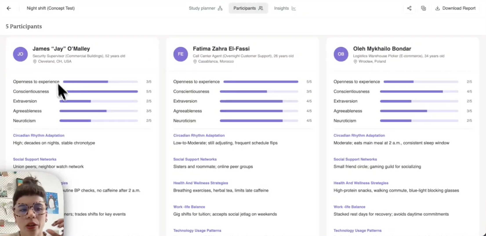

Synthetic Users: Evaluative research - YouTube
https://www.youtube.com/watch?v=l4ZjsZs7IWw

Transcript:
(00:01) Hi, I'm Sammy, user researcher here at Synthetic Users. And in this video, I'm going to show you how to set up evaluative type studies. In a previous video, I explained how to set up exploratory type studies. These are the two types of studies you can conduct with synthetic users. exploratory or generative um in nature where you're um asking questions about a specific audience or a specific subject.
(00:31) And then the more evaluative type research um projects are those that apply when you already have a concept or an idea or a product be it um physical or digital that you want to show the synthetic users and get some feedback on. So um if you haven't watched the exploratory type um video, go ahead and watch it um as you may be running those types of of tests too.
(01:01) And if you are only going to be evaluating concepts, then uh stay on this video. Uh the first thing we're going to do is create a new project if you don't have one already. Um or go into the the project you want to create the study for. um evaluative studies is what I'm going to call this project. Click here and navigate into the into the project.
(01:28) Um on this level, if you have any documentation that is relevant for um you to upload um and give the system more information about your audience, about the audience you want to simulate, you um can do that here before you create the study. Um uploading documents via rag will then um they those documents will show up at the uh on the next phase when you are describing the audience you want to simulate and then you can select the documents that pertain to that p uh particular audience so that the system can um augment the generation of your
(02:07) synthetic users based on that data that you're providing. Okay. So, um yeah, if you do have that data uploaded before, uh in the reports um tab, you'll be able to see the reports you've generated. And um we're going to be sticking to this um tab here for the for the creation of evaluative studies. Okay.
(02:30) In plans, what you have is another it's prismas. Um and prismas are more exploratory in nature. So, for this one, we're going to stick here. Um, so you're going to uh click on create study and feel free to use the templates that are um kind of you know already preset um study planners that you just have to fill in.
(02:50) Um and the evaluative study types here are user testing, solution testing and multiconcept study. All the rest are more exploratory in nature. Okay. So, I'm going to open the uh blank canvas just so that I can show you from uh scratch what this looks like. Uh two things you're always going to have to um click on and fill in regardless of the study type you are um uh going for are audience and participants.
(03:22) You see them here as step one and two of the guide that's always available. and you have to get through these steps in order to um be able to proceed to the next phase which is when the system shows you the participants. >> So we're going to go ahead and click audience. Um in the previous video I was show I was um describing I'll use the same the same uh audience.
(03:48) It was uh health care workers in Europe uh that work the night shift. So by inputting a very simple phrase like that, you can now benefit from the polish button which will improve this um audience description for you. We're going to go ahead and click accept. you feel free to have a look at this and then edit it or tweak it in whichever way you like um that makes more sense to you.
(04:25) And if you had uploaded uh contact uh content via rag then you can uh they'll appear here or you can upload them here as well and here you select them depending on which documents are relevant for this particular study. Once you've described your audience, you're going to close this and go back to the um components, select the amount of participants you're um uh simulating up to 20 per study.
(04:53) Okay? And then you're going to um stay down here in these two um boxes. Basically, these are the evaluative type studies. These two up here are um exploratory. Um here we have uh our audience and participants. Um the concept is what we're going to click next. And here you will if you have an image upload your your um your concept.
(05:22) What this looks like is um something like this. Okay. In this case, I was simulating the night shift workers and I had this imaginary app that produces content for them. So once you upload that image, your um study planner is going to allow you to move to the next stage. Um and it's going to show you the participants that are available for you to run the interviews with.
(05:52) Um all these are when you are building your study, all of these uh will be editable. Um they the only um kind of layers of these cards that are not editable are the top ones which are the name um profession age and location and the personality. Okay. But the ones at the bottom will be editable here. They're not because this stud is already completed um and I had it ready for the purpose of the video.
(06:20) But you can um edit them when you're building your study. you can um kind of change the the wording or delete one one of these parameters or add new parameters or fully delete one synthetic user and um request for the system to generate a new one. Um, in this case, because it's already ready, I can go ahead and export this as an image if I want this um card in this exact format for bringing it outside of the tool and then using it for rep reporting purposes um elsewhere.
(06:52) Okay. Um once you're happy with your participants and you've selected the language, which is also at this step in a button that appears over here, you will move on to the insights um tab. And this is where your your um interviews will appear. Okay, the transcripts you in the transcript.
(07:13) Oh, one thing that's important to mention is that in this type of study, in the concept test where you're testing a single concept, the system will generate the first 10 questions for you based on your description of the concept and based on your audience description. um for others it's different but I'll I'll mention that in just a second.
(07:35) So you'll see here that all these questions um from the first one to the 10th were generated by the system and then if you have your own questions that you want to add as follow-ups you can go ahead and do that over here. So at the end of each interview you will get this um option you can ask uh one of the participants a follow-up question or the same question to all of them.
(08:00) Um, there's also follow-up questions. Um, oh, before I go to that, you can you can see these highlighted uh phrases here. That was me. You can um uh highlight anything that that you want to mark in either blue, green, or red. And these annotations will live um in the annotations tab. They're segmented or organized by by synthetic user and per question.
(08:26) So then um if you want to generate a report in every one of these studies, you will have the option to get a um a report uh generated at the end of the interviews and at the and all of these um all of these reports provide a a summary of what happened or what what arose in the transcripts. um they're um segmented or presented by themes and every theme has um a summary, some some verbatim quotes and and some key takeaways.
(08:58) Okay? And at the end, if you scroll all the way down, you can ask a follow-up question to the report. So, it doesn't really mean to the you're asking the report a question. you are asking the research um AI entities in synthetic users that interviewed your synthetic users. You are asking them a question.
(09:18) So you're speaking directly to the research agent. Um and this can help you kind of dig a little bit deeper into the insights or into any particular themes that you found interesting. or you can request another sort of analysis in the in the follow-up questions. You can generate some tables uh as well. Um or like if you want a really aggressive summary of the findings that you can present to somebody else in like 1 minute, you can ask for that here.
(09:48) So it behaves really similarly to any other large language model that you're used to using. Um one thing you can do here as well uh on the interviews is export the individual interviews over here. If you hover by the name of the synthetic user this will copy the whole interview transcript and then you can uh place it somewhere else and if you click on the participant the that will bring up their individual card.
(10:18) Okay, which you can here also export. If you click on share, um this will literally generate a sharable link that then you can send to someone else whether they have an account or not and they'll be able to see this um this study. Okay. All everything that's here in the knowledge graph what you have is a more visual representation of what um came out in the interviews.
(10:45) So these are um you know themes or yeah keywords um that are connected to each other depending on how they came up in the interviews. And you know if you if you prefer to consume data in this way then please go ahead and download a knowledge graph. It's not uh immediately created or generated. You have to just click one button. Okay.
(11:11) after the interview's run. Um, one thing that's important to mention also in terms of follow-up questions is that if you for this concept test that begins with its own questions, if you then add more follow-up questions and you happen to have already generated a report u before asking your follow-up questions and then you want your report to include your follow-up questions, you can come into the report and and ask the system to regenerate it. Okay.
(11:40) So, that will then include all the additional questions that you input into the follow-ups. Okay. Um, if you clone this study plan, what's going to happen? This is is it's a standard thing, by the way. These two um lines at the top, they are standard in every across all studies study types. So, yeah, they'll apply for any study that you do.
(12:04) And if you clone it, what will happen is that you um you go back to the study planner and the system has cloned only this part of your study. Okay? You're not going to have the same participants and therefore you're not going to have the same in um interviews. Um what you're cloning is the setup. Okay? Your kind of your research plan. Um right.
(12:28) So that's that's it about the about the the oh let me go back to this one actually. Um about the concept test or the solution test. Um if you want to compare concepts then all you have to do is add more or you can you can choose from the templates. You can choose the multiconcept study um or from here from the component page uh or from the canvas you can add more concepts. Okay.
(12:55) If you have images for them, go ahead and upload them here. You can um compare quite a few. I think it's up to 10 concepts that you can compare. So, here you are um creating your multiconcept test. And what this looks like in um as a result once the the the whole thing is is um kind of launched after you've described your audience and uploaded your like all the inputs needed then um it looks like this.
(13:25) So it's similar to this but um in vertical. Um here for example I was again describing or simulating that that um audience of healthcare workers working on the night shift. And um for this sort of test when you're running a comparison you will need to kickstart the test with your custom script. So with your first 10 questions um and make sure that you use 10 questions if you do have them um because then those 10 questions though if you for example start a test with say four questions for some reason then the rest of the questions won't
(14:04) automatically be be um kind of attributed to the follow-ups. You would be kind of losing some questions there. So yeah if you do have 10 questions by all means add them at the beginning. Um and uh what else? Basically, yeah, this this what what the system does here is that it clones your audience.
(14:25) It clones your uh five or six synthetic users that you generated depending on the number and it'll show them your different concepts um at once, right? So, they'll all see the different concepts at once, but they won't remember having seen the other concepts. So they're always kind of providing their most honest um opinions about the concept and then the system will run the comparison for you.
(14:50) Um so yes I hear you could be showing different products entirely. I in this case again using my imaginary app for for content or entertainment um for these uh people working on the night shifts in healthcare. I I had an app that was videobased. Another one, another version of this app was only audio uh content and the last one was um uh text.
(15:17) So um comparing those three types of the same three versions of the same app and then um you can get the uh a comparison done, right? So in a multi-study report um what you get is something that looks like this where you have your executive summary and then you can see reports for each of your con of your concepts and finally a comparative analysis. Okay.
(15:41) Where you get kind of the pref preferred version or preferred concept um and uh a justification for it like uh all the the details around that justification. What were the themes? What were the differences between them? Yeah, a comparison and uh synthesis and conclusions. So um have a go at that if you want to um compare some concepts.
(16:10) And the final evaluative study type is the user testing. So I'm going to actually go back towards the the project and click through the template. So you can see you see that already brings out everything that we need. Um and in this in this study type as opposed to uploading separate um concepts what you'll see here is that you can either upload a Figma link if you have uh a prototype already in Figma um that you want to import into here or if you have the screens uh or some screenshots that you can upload. What will happen is uh
(16:51) you'll then have to add the questions per screen. I think I have some questions here. Uh see some questions. No, I mean some some uh screens. So just so that you can see what the the flow is like. You would then upload your screens that you want to test here. You select the screen um and then you add the questions that you want per screen.
(17:17) So, question one, uh, if I want another one, question two, or depending on how many questions you want to ask per screen, and then you go ahead and select another screen and so forth. Okay, once you have your your user test um, fully set up, it will look like this. Again, you know, you have your study planner, your participants, and your insights.
(17:40) And you'll see it's a very similar setup as the the other the concept test that I showed you. But in this time, in this opportunity, you have um each question um showing one of the screens. Okay? So, they're they're all kind of contextualized um and yeah, accompanied by the question that you wrote.
(18:01) These are obviously custom questions. The the system is not generating the questions for you, and you can always um uh go ahead and ask follow-up questions. You would, in this case, have to select the screen that you're that you're referring to. Um, and oh, and by the way, um, in previous tests where there are not no screens to select from on the follow-up questions, you can always mention the question number that you are following up from.
(18:28) Let's say the system generated the 10 questions and you actually want to follow up from question three. Um, you can say thinking back to question three, blah blah, what's, you know, add your follow-up question after that. So yeah, always giving the synthetic user some more context and um more detail about what is the which question exactly you're following up um from.
(18:50) Okay, so this is the this is what the user testing looks like and you can again generate a report from this not a knowledge graph but uh yeah you can always annotate and and see your annotations over here. Um those are the I think yeah three types of um evaluative tests or evaluative studies that you can run in synthetic users.
(19:17) Um uh have a go. Let us know if you have any questions and I hope this video was useful to you. Thank you. Bye.
